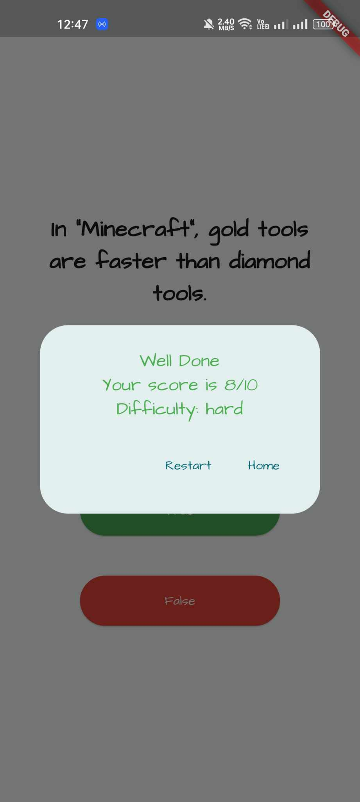

# Da Trivia App - Fun True or False Quiz

## Description
Da Trivia is a simple and fun True or False quiz app designed to test your knowledge on various topics. The app presents you with 10 easy and entertaining true or false questions that you can answer with just a tap. Challenge yourself and your friends to see who can get the highest score!

### Click the download button below to download the app.

## Features
- 10 True or False questions.
- Easy and fun questions suitable for all ages.
- Simple and intuitive user interface.
- Track your score and challenge yourself to improve.

## Screenshots
Include screenshots of the app's user interface to give users a glimpse of what to expect.

## How to Play
1. Download and install the "Da Trivia" app from the GitHub.
2. Launch the app and select difficulty level and click on "Start Game".
3. You will be presented with a series of true or false questions, one at a time.
4. Read the question carefully and tap on "True" if you think the statement is correct, or tap on "False" if you believe it is false.
5. After answering all 10 questions, you will see your final score and the correct answers.
6. Share your score with friends and challenge them to beat your record!

## Question Examples
1. True or False: The capital of France is Paris.
2. True or False: The sun revolves around the Earth.
3. True or False: Elephants can fly.
4. True or False: Water boils at 100 degrees Fahrenheit.
5. True or False: The Great Wall of China is visible from space.
6. True or False: Bees produce honey.
7. True or False: Humans have five senses.
8. True or False: The Earth is flat.
9. True or False: The Statue of Liberty was a gift from France.
10. True or False: Penguins can fly.

## Technologies Used
- The app is built using flutter, a cross-platform UI toolkit for building beautiful, natively compiled applications for mobile, web, and desktop from a single codebase.

## Credits
- Question sources (Open Trivia Database): https://opentdb.com/api_config.php

## Feedback and Support
We value your feedback! If you encounter any issues or have suggestions for improvement, please email us at `codesconan@gmail.com`. We are constantly working to enhance your trivia experience.

Have fun and enjoy playing Da Trivia!
